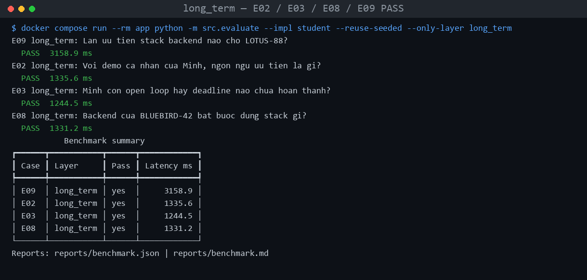
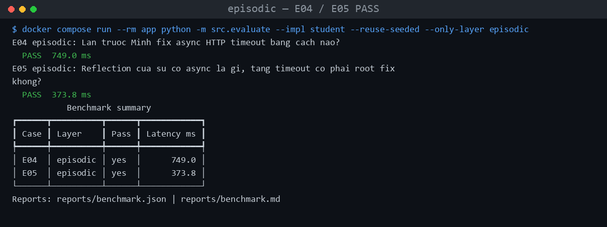
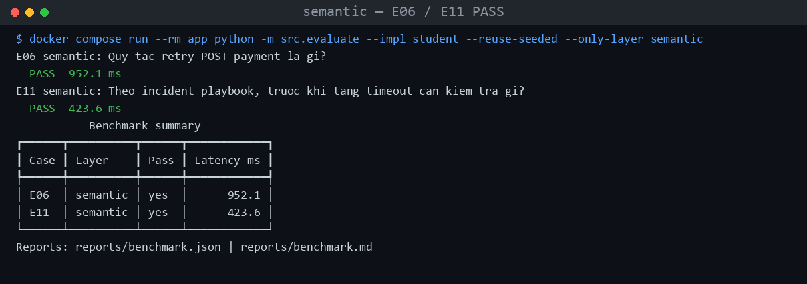
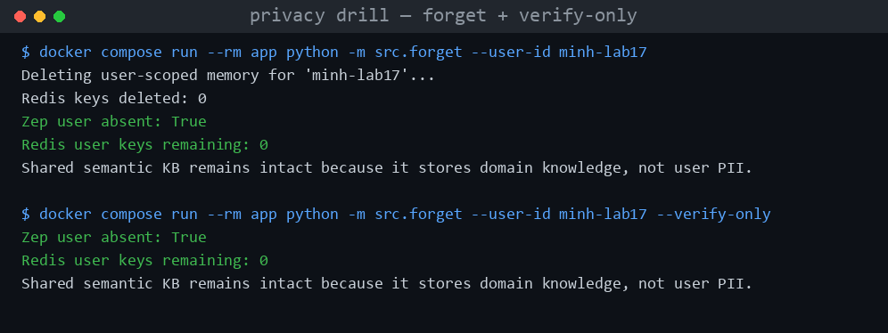

# README_submission — Lab 17 Multi-Memory Agent

Practice: **11/11 PASS**. Golden: **20/20 PASS (+10)**.

## 1. Ba cau bat buoc

**Layer quan trong nhat (case):** `long_term`. Phu 4/11 case (E02, E03, E08, E09) — nhieu nhat trong 4 layer — va ganh 2 thuoc tinh kho: recency (E08 — `BLUEBIRD-42` phai tra `TypeScript`/`NestJS`, khong phai `Python` ca nhan) va isolation (E09 — Lan khong duoc leak `ORCHID-27` cua Minh). Sai layer nay mat diem nhieu nhat va de leak du lieu cheo user.

**Trade-off Context Block/Zep vs Redis+Qdrant:** Zep cho relevance search + fact extraction + recency co san — nhanh phat trien nhung doi lay latency mang (~900ms/case vs <2ms Redis local) va it kiem soat ranking. Redis+Qdrant (`src/local_baseline.py`) nhanh, local, nhung phai tu viet dedup/decay/conflict — ton cong hon de cung chat luong.

**Guardrail chong memory poisoning:** user-scoped namespace (`user_id` rieng moi search); consent gate (`require_memory_consent`); PII minimization + `cap_query` (400 ky tu, chong prompt-injection dai); right-to-be-forgotten (`src/forget.py`); moi fact co `valid_at`/provenance de audit.

## 2. Bon cau phan tich benchmark

1. **Layer hit rate thap nhat:** ca 4 layer dat 100%, nhung `long_term` mong manh nhat duoi ap luc ngan sach — golden marker `LAB-REPORT-1600` (G16) tung bi cat boi ngan sach 4% cho toi khi rut gon dinh dang fact (`docs/TODO_IMPLEMENTATION.md`).
2. **Case retrieve nhieu token nhat:** E03 (long_term) — 1086 token, vi long_term dung rieng khong qua `ContextBudgetManager`, giu nguyen context block + 20 fact.
3. **E07 (mixed) can:** `long_term` (`Python`) + `semantic` (`Idempotency-Key`), ghep qua `assemble_context` theo ngan sach 10/4/3/3.
4. **Token reduction & vi sao no-memory "giam" nhieu ma hit rate thap:** 19.1% (memory-enabled) vs 81.8% (no-memory, `reports/comparison.md`) — no-memory giam nhieu chi vi khong retrieve gi ca, vo nghia neu tach khoi hit rate: no-memory 18.2% (2/11) vs memory-enabled 100%.

## 3. Hai case bo sung

**E08 (recency):** Minh thich Python cho ca nhan; cong ty (`BLUEBIRD-42`) sau do bat buoc `TypeScript`+`NestJS`. Zep gan `valid_at`/`invalid_at` theo fact — fact cu bi invalid, fact moi uu tien, tra dung theo scope du an, khong xoa lich su.

**E10 (compaction):** sliding giu K turn gan nhat + durable notes tu turn bi evict. Giam `max_recent_messages` 6→4, turn goc chua `REVIEW-DEADLINE-1600` bi evict nhung deadline van con vi da vao durable note — khac buffer tho phai phinh token tuyen tinh moi khong mat tin.

## 4. Anh bang chung

